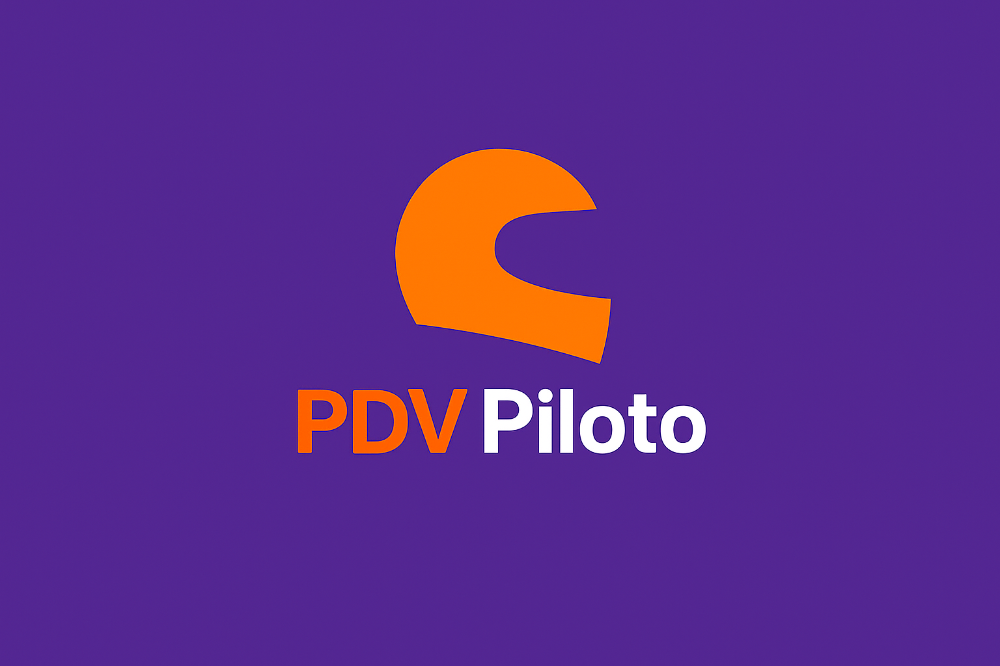

# 📖 Sobre o Projeto PDV Piloto

**[← Voltar ao README Principal](../README.md)**

---

  
  
  <h3>Sistema Multi-Adquirência para Dispositivos POS</h3>
  
  
<strong>Versão 1.0.0 Release 1</strong>

---

## 🎯 Visão do Projeto

O **PDV Piloto** nasceu da necessidade de criar uma solução unificada para integração de múltiplas adquirentes de pagamento em dispositivos POS Android. Em um mercado fragmentado, onde cada adquirente possui seu próprio SDK e particularidades, empresas são forçadas a desenvolver e manter aplicativos separados para cada provedor de pagamento.

### 💡 A Ideia

Criar um **ecossistema tecnológico** que:

- 🔄 **Unifique** APIs de diferentes adquirentes sob interfaces comuns
- 📦 **Module** SDKs em packages independentes e reutilizáveis
- 🏭 **Suporte** múltiplos fabricantes de hardware sem duplicação de código
- 🚀 **Escale** facilmente para novos provedores de pagamento
- 💰 **Reduza** custos de desenvolvimento e manutenção

### 🌟 Diferenciais

1. **Arquitetura MonoRepo**
   - Packages modulares e isolados
   - Código compartilhado entre adquirentes
   - Versionamento unificado

2. **Multi-Adquirência**
   - Stone (implementado)
   - Cielo, PagSeguro, GetNet, Rede (preparado)
   - Troca dinâmica via Factory Pattern

3. **Multi-Fabricante**
   - 5 fabricantes Stone: Gertec, Ingenico, Positivo, Sunmi, Tectoy
   - Product Flavors no Gradle
   - Um código → múltiplos APKs

4. **Type-Safe**
   - 100% TypeScript
   - Interfaces bem definidas
   - Erros em compile-time

---

## 🏢 Sobre a Nebula Sistemas

  <h3>Nebula Sistemas - Soluções Tecnológicas Inovadoras</h3>

### 📍 Localização

**Nebula Sistemas Ltda**  
📍 Betim, Minas Gerais - Brasil

### 🎯 Missão

Desenvolver soluções tecnológicas inovadoras que simplifiquem processos complexos e gerem valor real para nossos clientes.

### 💼 Áreas de Atuação

- **Pagamentos Digitais**: Integração com adquirentes e sistemas POS
- **Mobile Development**: Apps React Native e nativos
- **Arquitetura de Software**: Sistemas escaláveis e manuteníveis
- **Consultoria Técnica**: Design patterns e boas práticas

### 🛠️ Tecnologias

- React Native / TypeScript
- Kotlin / Java
- Arquitetura MonoRepo
- Clean Architecture / SOLID
- CI/CD / DevOps

### 🏆 Especialidades

- ✅ Integração com múltiplas adquirentes (Stone, Cielo, PagSeguro)
- ✅ Desenvolvimento para dispositivos POS
- ✅ Arquitetura modular e escalável
- ✅ Deep Links e comunicação nativa
- ✅ Impressão térmica em PDVs

---

## 👥 Equipe do Projeto

### Arquitetura e Desenvolvimento

**Rodrigo Baia**  
- Arquiteto de Software
- Especialista em React Native
- Desenvolvedor Full Stack

### Nebula Sistemas - Equipe Técnica

- **Mobile Development Team**: Desenvolvimento React Native e integração nativa
- **Quality Assurance**: Testes em dispositivos reais
- **DevOps**: Automação de builds e deploy

---

## 📊 Informações Técnicas do Projeto

### Versão Atual

**1.0.0 Release 1**

### Stack Tecnológica

| Camada | Tecnologia | Versão |
|--------|-----------|--------|
| **Frontend** | React Native | 0.81.4 |
| **UI Library** | React | 19.1.0 |
| **Linguagem** | TypeScript | 5.8.3 |
| **Backend/Native** | Kotlin | 1.9+ |
| **Build System** | Gradle | 8.14.3 |
| **Runtime** | Java | 17 |
| **SDK Pagamento** | Stone SDK | 4.13.0 |

### Métricas do Projeto

| Métrica | Valor |
|---------|-------|
| **Linhas de código** | ~5.000+ |
| **Documentação** | 6 documentos (5.500+ linhas) |
| **Packages** | 6 (MonoRepo) |
| **Adquirentes** | 1 implementada, 4 planejadas |
| **Fabricantes** | 5 suportados |
| **Scripts** | 8 automatizados |

### Cronologia

| Data | Evento |
|------|--------|
| **Out/2025** | Início do desenvolvimento |
| **Out/2025** | Integração Stone concluída |
| **Out/2025** | v1.0.0 Release 1 - Primeira versão |
| **Q1/2026** | Integração Cielo (planejado) |
| **Q2/2026** | Integração PagSeguro (planejado) |

---

## 🎯 Objetivos do Projeto

### Curto Prazo (2025)

- ✅ Implementar Stone SDK completo
- ✅ Suportar 5 fabricantes Stone
- ✅ Documentação completa
- ✅ Scripts automatizados
- 🔄 Testes em produção

### Médio Prazo (2026)

- 🚧 Implementar Cielo SDK
- 🚧 Implementar PagSeguro SDK
- 🚧 Dashboard analítico
- 🚧 Modo offline
- 🚧 Cancelamento de transações

### Longo Prazo (2027+)

- 📅 GetNet e Rede SDKs
- 📅 Versão iOS
- 📅 App administrativo web
- 📅 White-label para terceiros
- 📅 Cloud sync em tempo real

---

## 🌍 Casos de Uso

### 1. Redes de Varejo

Lojas com múltiplas adquirentes podem usar um único app configurando a adquirente por loja.

### 2. Delivery e Marketplaces

Entregadores realizam pagamentos na entrega com impressão de cupom instantânea.

### 3. Franquias

Franqueados em diferentes regiões usando diferentes adquirentes mantêm o mesmo app.

### 4. Empresas em Migração

Troca de adquirente sem reescrever código, apenas configuração.

---

## 📞 Contato

### Nebula Sistemas

- 📧 **Email**: suporte@nebulasistemas.com.br
- 🌐 **Website**: www.nebulasistemas.com.br
- 📍 **Endereço**: Betim, Minas Gerais - Brasil

### Suporte Técnico

Para questões técnicas sobre o PDV Piloto:
- 📧 Email: dev@nebulasistemas.com.br
- 📚 Documentação: Veja pasta `docs/`
- 🐛 Issues: GitHub Issues

---

## 📄 Licença

**Proprietary License** - © 2025 Nebula Sistemas Ltda

Todos os direitos reservados. Este software é propriedade da Nebula Sistemas e seu uso, cópia ou distribuição não autorizada é estritamente proibida.

### Termos de Uso

- ✅ Uso interno pela Nebula Sistemas e clientes autorizados
- ✅ Desenvolvimento e testes em ambientes controlados
- ❌ Distribuição não autorizada
- ❌ Uso comercial sem licença
- ❌ Modificação sem autorização

---

## 🙏 Agradecimentos

### Tecnologias Open Source

Agradecemos às comunidades e projetos que tornaram este desenvolvimento possível:

- **React Native Team** - Framework mobile excepcional
- **Microsoft TypeScript** - Linguagem type-safe
- **Stone Payments** - SDK e documentação
- **JetBrains Kotlin** - Linguagem moderna para Android
- **Gradle** - Sistema de build robusto

### Inspirações

Este projeto foi inspirado por:
- Google's MonoRepo approach
- Facebook's Metro bundler
- Netflix's modular architecture
- Uber's multi-platform strategy

---

## 🔗 Links Úteis

### Projeto

- [README Principal](../README.md)
- [Documentação Completa](./visao-geral-projeto.md)
- [Guia de Instalação](./integracao-stone.md)
- [Como Contribuir](./adicionar-adquirente.md)

### Nebula Sistemas

- [Website](https://www.nebulasistemas.com.br)
- [Portfólio](https://www.nebulasistemas.com.br/portfolio)
- [Carreira](https://www.nebulasistemas.com.br/carreiras)
- [Contato](https://www.nebulasistemas.com.br/contato)

---

## 📜 Histórico de Versões

### v1.0.0 Release 1 (Outubro 2025)

**Primeira versão do PDV Piloto**

**Funcionalidades:**
- ✅ Integração Stone completa via Deep Links
- ✅ Pagamento Crédito e Débito
- ✅ Impressão de cupons térmicos
- ✅ Suporte a 5 fabricantes (Gertec, Ingenico, Positivo, Sunmi, Tectoy)
- ✅ Arquitetura MonoRepo escalável
- ✅ Scripts automatizados de build
- ✅ Documentação completa

**Estatísticas:**
- 5.000+ linhas de código
- 5.500+ linhas de documentação
- 8 scripts automatizados
- 6 packages modulares
- 5 APKs por build

---

## 🔗 Navegação

- **[← README Principal](../README.md)** - Voltar ao início
- **[📚 Visão Geral](./visao-geral-projeto.md)** - Proposta detalhada
- **[🏗️ Arquitetura MonoRepo](./arquitetura-monorepo.md)** - Estrutura técnica
- **[🟢 Integração Stone](./integracao-stone.md)** - Implementação
- **[🔌 Adicionar Adquirente](./adicionar-adquirente.md)** - Expandir

---

**Desenvolvido com ❤️ pela equipe Nebula Sistemas**  
**Betim, Minas Gerais - Brasil**  
**© 2025 Nebula Sistemas Ltda. Todos os direitos reservados.**

